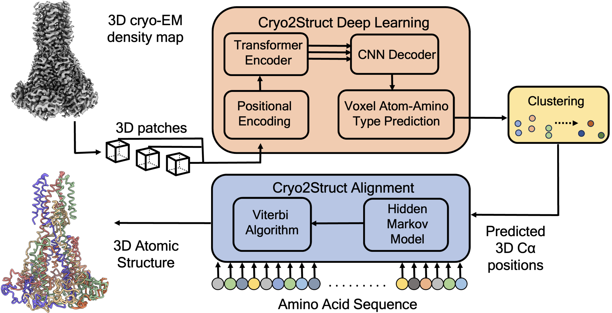

# Cryo2Struct: De Novo Atomic Protein Structure Modeling for Cryo-EM Density Maps Using 3D Transformer and Hidden Markov Model


Cryo2Struct is a fully automated ab initio cryo-EM structure modeling method that first employs a 3D transformer-based model to identify atoms and amino acid types in cryo-EM density maps. It then utilizes a novel Hidden Markov Model (HMM) to connect predicted atoms, building the backbone structures of proteins. The dataset used to train and validate Cryo2Struct is available on [Cryo2StructData Dataverse](https://doi.org/10.7910/DVN/FCDG0W) , and the description of the data preparation and labeling process can be found in [Cryo2StructData Paper](https://doi.org/10.1038/s41597-024-03299-9), [Cryo2StructData GitHub](https://github.com/BioinfoMachineLearning/cryo2struct). The detailed information about the test datasets including the EMD IDs of the density maps and the evaluation scores are provided in two Excel files (Standard_test_data.xlsx for the standard test dataset and Cryo2Struct_test_data.xlsx for the new test dataset) available at [Cryo2Struct Dataverse](https://doi.org/10.7910/DVN/GQCTTD), and the true structures along with the structural models built by Cryo2Struct is also available in the same Cryo2Struct Dataverse website. 



## Cryo2Struct Capsule on Code Ocean

[Cryo2Struct Capsule on Code Ocean](https://doi.org/10.24433/CO.9328198.v1) is a self-contained, fully pre-configured computing environment that includes Cryo2Struct's code, data, version history, and results. This capsule facilitates effortless replication of results. To access and run the Cryo2Struct Capsule, simply visit the [Cryo2Struct Capsule on Code Ocean](https://doi.org/10.24433/CO.9328198.v1) and click on ``Reproducible Run``. Explore the code, modify parameters, and rerun the experiment to observe the impact on results. Cryo2Struct Capsule is:

- **Self-contained**: All necessary dependencies, code, and data are encapsulated within the Cryo2Struct capsule.
- **Version History**: Easy to track changes and access previous versions of the code and results.
- **Reproducibility**: Ability to reproduce results reliably, both in the present and in the future.


## Setup Environment (Locally)
To setup Cryo2Struct locally, follow the steps below. It takes about 3-7 minutes to set up the environment to run Cryo2Struct.

Clone this repository and `cd` into it
```
git clone https://github.com/jianlin-cheng/Cryo2Struct.git
cd ./Cryo2Struct
```

We will set up the environment using Anaconda. This is an example of setting up a conda environment to run the code. Use the following command to create the conda environment using the ``cryo2struct.yml`` file.

```
conda env create -f cryo2struct.yml
conda activate cryo2struct
```

## Atomic structure modeling using Cryo2Struct

1. <ins>**Input**</ins>: **cryo-EM density map and sequence** : First, you need to prepare your own data or use our provided example data. The directory should be organized as follows:
```text 
cryo2struct
|── input
    │── 34610
        │-- emd_34610.map
        |-- 8hb0.fasta
```
The `emd_34610.map` is the density map with EMD ID: 34610 downloaded from EMDB website. The `8hb0.fasta` is the corresponding sequence file. 

The first step is to make input cryo-EM map ready for Cryo2Struct. We run [UCSF ChimeraX](https://www.cgl.ucsf.edu/chimerax/index.html) in non-GUI mode to resample the density map to 1 Angstrom, please install it to preprocess the map. We used ChimeraX 1.4-1 in CentOS 8 system. Once ChimeraX is installed, then please run the following.

```
bash preprocess/run_data_preparation.bash input/
```
In the above example ``input/`` is the ``absolute input path`` where the maps are present.

**Note**: For this example, the normalized map is provided, so there is no need to run the above bash command to prepare the map. Hence, the directory structure for this example looks like this:

```text 
cryo2struct
|── input
    │── 34610
        │-- emd_34610.map
        |-- emd_normalized_map.mrc
        |-- 8hb0.fasta
```

2. **Running Cryo2Struct**
The deep learning requires trained atom and amino acid type models. The trained models are available in [Cryo2Struct Harvard Dataverse](https://doi.org/10.7910/DVN/GQCTTD). Use the following to download the trained models. 

```
cd models
wget -O amino_acid_type.ckpt https://dataverse.harvard.edu/api/access/datafile/8076563
wget -O atom_type.ckpt https://dataverse.harvard.edu/api/access/datafile/8076564
cd ..
```

The organization of the downloaded models should look like:
```text 
cryo2struct
|── input
    │── 34610
        │-- emd_34610.map
        |-- emd_normalized_map.mrc
        |-- 8hb0.fasta
|── models
    │-- amino_acid_type.ckpt
    |-- atom_type.ckpt
    |-- aa_regression_model.pkl
    |-- ca_regression_model.pkl
```

Update the configurations in the [config/arguments.yml](config/arguments.yml) file. Especialy the input data directory, trained model checkpoint path,  and density map name. By default the program runs inference in `CPU`, running the inference program on the ``GPU`` speeds up prediction. To enable ``GPU`` processing, modify ``infer_run_on`` in the configuration file to ``gpu`` and provide the GPU device id on ``infer_on_gpu`` (example: 0). One way to update the configuration by using visual editor (``vi``).

```
vi config/arguments.yml
```


**Compile Modified Viterbi algorithm:**
The Hidden Markov Model-guided carbon-alpha alignment programs are available in [viterbi/](viterbi/). The alignment algorithm is written in C++ program, so compile them using: 

```
cd viterbi
g++ -fPIC -shared -o viterbi.so viterbi.cpp -O3
cd ..
```
During the compilation, if the program asks for installation of `gcc-c++` package, then install it following the instructions. GCC C++ compiler is required to compile `viterbi.cpp`.

If the compilation of the program fails due to library issues (which typically occurs when attempting to compile on older systems), you can try compiling using the following approach:
```
cd viterbi
conda install -c conda-forge gxx
g++ -fPIC -shared -o viterbi.so viterbi.cpp -O3
cd ..
```
The above command installs the ``gxx`` package in the activated conda environment, which provides the GCC C++ compiler. This compiler is useful for compiling C++ code on the system. The HMM alignment program runs on the ``CPU`` and is optimized at the highest level using the``-O3`` flag. We tested, and the above compilation was successful on CentOS 7, 8, and AlmaLinux OS 8.8, 8.9. 

Finally, run the following:

```
python3 cryo2struct.py --density_map_name 34610
```

4. <ins>**Output**</ins>:  **Modeled atomic structure**
The output model is saved in the density map's directory. The modeled atomic structure for this example is saved as [input/34610/34610_cryo2struct_full_conf_score.pdb](input/34610/34610_cryo2struct_full_conf_score.pdb). To visualize the structure, use [UCSF ChimeraX](https://www.cgl.ucsf.edu/chimerax/index.html). To enable the color spectrum (confidence score) in UCSF ChimeraX, navigate to Tools > Depiction > Render by Attribute and select 'bfactor' as the attribute. It took 9.19 minutes to model the structure for cryo-EM density map ``34610``. 


5. <ins>**Confidence Scores**</ins>: 
Cryo2Struct provides a per-residue estimation of confidence within the range of [0, 1] for both carbon-alpha and amino acid type predictions. An example confidence score file and plot are available in [input/34610/](input/34610/). 

## Evaluation
The evaluation results presented in the paper is computed using [Phenix's chain_comparison tool](https://phenix-online.org/documentation/reference/chain_comparison.html) and [US-align](https://zhanggroup.org/US-align/). US-align can be run in it's web server, however, the Phenix needs to be installed locally to compute the metrics. After installation of Phenix tool, run the following:

```
phenix.chain_comparison target.pdb query.pdb
```


## Training Cryo2Struct Deep Learning
The training programs are available in the [train/](train/) directory. Cryo2Struct was trained on Cryo2StructData, which is accessible on the [Cryo2StructData Dataverse](https://doi.org/10.7910/DVN/FCDG0W). Download the full dataset from [Cryo2Struct Full Dataset](https://doi.org/10.7910/DVN/FCDG0W) or a small subset from [Cryo2Struct Small Subsample Dataset](https://doi.org/10.7910/DVN/CGUENL). After downloading the dataset, `unzip` the compressed files. The directory names are the EMD ID of the cryo-EM density map.

The dataset contains the preprocessed map ready for deep learning training. However, the cryo-EM density map label needs to be prepared. Run the following


```
python3 label/get_atoms_label.py density_map_directory
python3 label/get_amino_labels.py density_map_directory
```

The `density_map_directory` is the absolute directory path where unzipped cryo-EM density maps are present. The above scripts generate the atom and amino acid-type labels, which are used during the training of the deep learning model.

Split the data into training and validation sets. If you choose to use our predefined training and validation splits, refer to the Excel sheet in [Cryo2Struct Metadata](https://doi.org/10.7910/DVN/JMN60H), which contains the IDs for the training and validation cryo-EM density maps. Create separate directories for training and validation, and move the corresponding data to each directory.


Generate sub-grids of cryo-EM density maps from training and validation dataset for training. These sub-grids are used for training the model. Run the following:

```
python3 train/grid_division_train.py train_map_directory train_sub_grids
python3 train/grid_division_train.py valid_map_directory valid_sub_grids
```

The `train_map_directory` is the directory containing training cryo-EM density maps, and `train_sub_grids` is the directory where the training sub-grids will be generated. Similarly, `valid_map_directory` is the directory containing validation cryo-EM density maps, and `valid_sub_grids` is the directory where the validation sub-grids will be generated. After generation of sub-grids, run:

```
ls train_sub_grids > train_splits.txt
ls valid_sub_grids > valid_splits.txt
```

We used the distributed data parallel (DDP) technique to train the models on 24 compute nodes, each equipped with 6 NVIDIA V100 GPUs with 32GB of memory. The training program can run on a single GPU, multiple GPUs, or a multi-node cluster with multiple GPUs. Finally, in the training scripts [train/cryo2struct_atom_train.py](train/cryo2struct_atom_train.py) and [train/cryo2struct_amino_train.py](train/cryo2struct_amino_train.py) change the values in `AVAIL_GPUS` to the number of GPUs available in the compute node, `NUM_NODES` to the number of available compute nodes, and set `BATCH_SIZE`, and `DATASET_DIR` to the path of the Cryo2Struct directory. Then, train the model by running:

```
python3 train/cryo2struct_amino_train.py    #trains amino acid-type prediction model
python3 train/cryo2struct_atom_train.py     #trains atom type prediction model
```
Monitor the training progress in [Weights and Biases](https://wandb.ai/site).


Optional: The source code for data preprocessing, label generation and validation of training data is available at [Cryo2StructData GitHub repository](https://github.com/BioinfoMachineLearning/cryo2struct).


## Contact Information
If you have any question, feel free to open an issue or reach out to us: [ngzvh@missouri.edu](ngzvh@missouri.edu), [chengji@missouri.edu](chengji@missouri.edu).

## Acknowledgements
We thank computing resource Summit supercomputer at the [Oak Ridge Leadership Computing Facility](https://www.olcf.ornl.gov/) for supporting training of the deep learning model. Additionally, we appreciate the High-Performance Computing (HPC) resource, Hellbender, located at the University of Missouri, Columbia, MO, which was used for both the inference and alignment process.

## Citing this work
If you use the code or data in this package, please cite:

```bibtex
@article{giri2024novo,
  title={De novo atomic protein structure modeling for cryoEM density maps using 3D transformer and HMM},
  author={Giri, Nabin and Cheng, Jianlin},
  journal={Nature Communications},
  volume={15},
  number={1},
  pages={5511},
  year={2024},
  doi={https://doi.org/10.1038/s41467-024-49647-6},
  publisher={Nature Publishing Group UK London}
}

```


## Visualizing the Atomic Structure Modeled by Cryo2Struct
The superimposition of the predicted backbone structure (in blue) with the known backbone structure (in gold) of EMD ID: 34610. The density map has a resolution of 2.9 Angstroms and was released on 2023-11-01.


